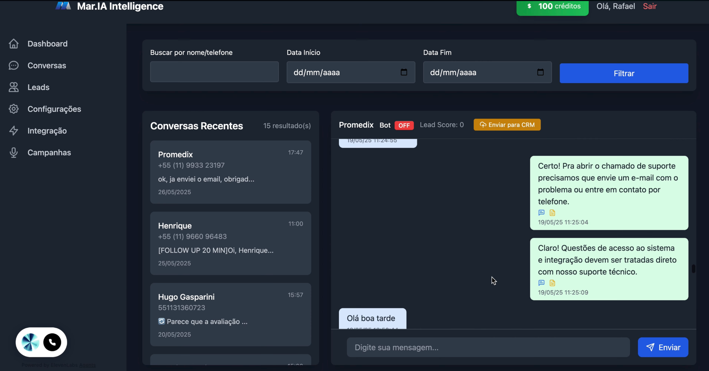
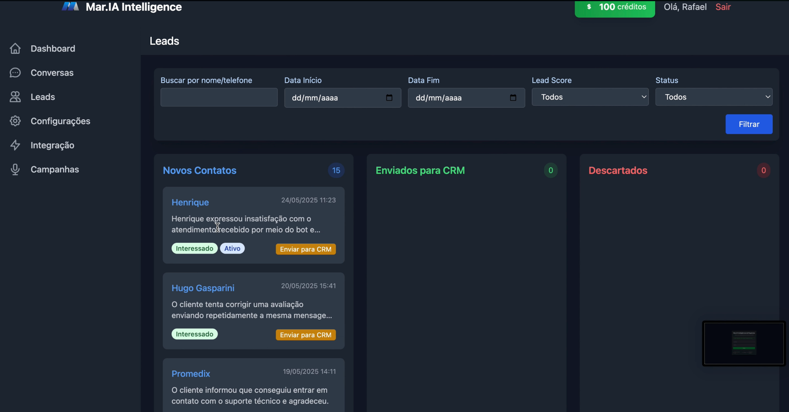
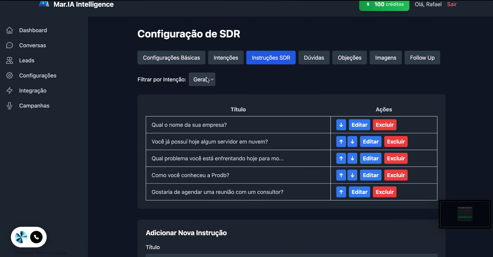

# AI Chat Ops Dashboard

AI-powered operations dashboard for conversations, lead management, and workflow automation.

## Overview

AI Chat Ops Dashboard is a product-oriented interface built to support customer conversations, lead handling, assistant configuration, and operational workflows in one place.

The system was designed with a practical applied-AI mindset: organize inbound demand, structure assistant behavior, improve handoff quality, and connect customer interactions with downstream business actions.

## Screenshots

### Conversations

### Leads

### SDR Configuration

## What this project includes

- Conversation management interface
- Lead handling and qualification flow
- CRM handoff support
- Assistant behavior configuration
- SDR instruction management
- Workflow-oriented operational dashboard
- Applied AI product structure

## Why it matters

This project reflects a practical product engineering approach for AI-assisted operations.

Instead of treating AI as a generic chat layer, the product focuses on real business workflows:
- manage inbound conversations
- configure assistant behavior
- organize lead flow
- support team operations
- connect chat interactions to business outcomes

## Tech stack

- PHP
- TypeScript
- Operational dashboard architecture
- AI-assisted workflow design
- CRM-oriented lead flow

## Current status

Public portfolio version of a real operations product.

This repository is being organized to better represent the product, interface, and engineering decisions behind the system.

## Author

Vitor Caponi  
Product Engineer building AI systems, automation workflows, and SaaS products.
